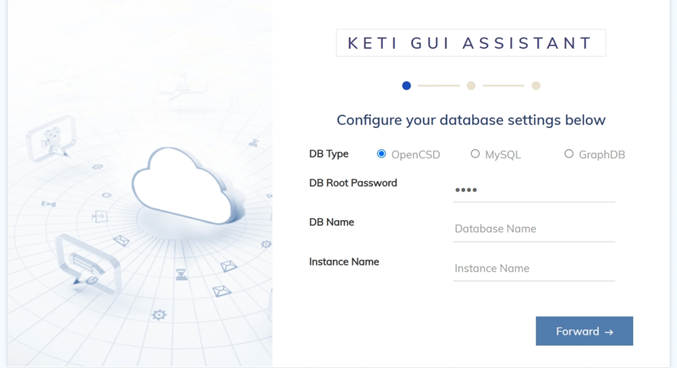
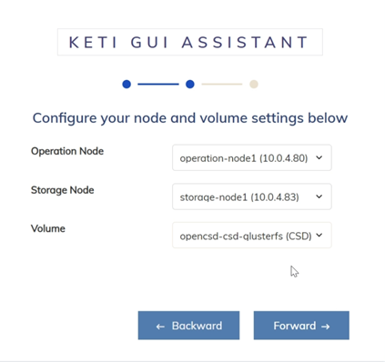
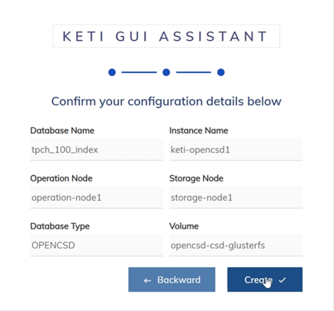

# Introduction of OpenCSD-GUI-Assistant
-------------

KETI-Web-Workbench enables users to monitor databases, perform query pushdown, and run validator to analyze resource utilization and energy savings.

## Contents
-------------
[1. Requirement](#requirement)

[2. How To Install](#How-To-Install)

[3. How To Use](#How-To-Use)

[4. Governance](#governance)


## Requirement
-------------
>   Python 3.7.5 <br>
>   Flask 2.2.5 <br>
>   Werkzeug 2.2.3


## How To Install
-------------
```bash
git clone
python3 main.py
```

## How To Use
-------------
### 1. Access a Web page
```bash
http://{address}:40802
```


1. Select DB Type
- OpenCSD : RDBMS-based OpenCSD instance with query offloading capability
- MySQL : Existing MySQL RDBMS
- GraphDB : Existing Neo4j GraphDB

2. Set DB Root Password
3. Set DB Name : Default DB Name
4. Set Instance Name

### 2. Select Operation and Storage Node in Cluster
Check and select the list of operation nodes and storage nodes within the cluster.



### 3. Confirm Creation Info
Finally check the set creation information and create an instance



## Governance
-------------
This work was supported by Institute of Information & communications Technology Planning & Evaluation (IITP) grant funded by the Korea government(MSIT) (No.2021-0-00862, Development of DBMS storage engine technology to minimize massive data movement)

